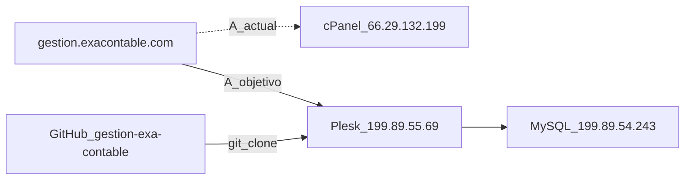

# Producción y despliegue — panel EXA Tareas (Plesk)

> **Otro producto:** el ERP PHP **exa-ofsercont** (`exa.ofsercont.com` / `199.89.54.243`) se documenta **aparte** en  
> `../exa-ofsercont/docs/PRODUCCION_OFSERCONT.md`. No uses esta guía para desplegar Ofsercont.

> **Hosting anterior:** cPanel `66.29.132.199` / usuario `exackbqq`. Quedó en [PRODUCCION_CPANEL.md](PRODUCCION_CPANEL.md). No desplegar ahí.

Guía operativa de **exa-tareas-app** (panel EXA Tareas + API ExaMonitor).

Repositorio: https://github.com/AngelvisYanez/gestion-exa-contable.git

Hay **dos hosts distintos** (no mezclarlos):

| Rol | Host | Uso |
|-----|------|-----|
| **Plesk (app web)** | `199.89.55.69` · dominio `gestion.exacontable.com` | Next.js · usuario de suscripción `gestion` |
| **MySQL EXA (ERP)** | `199.89.54.243` | Bases `exa` / `servicios` · **no** se movió con el cambio de hosting web |

| Dato | Valor |
|------|--------|
| URL producción | https://gestion.exacontable.com/ |
| Panel Plesk | https://199.89.55.69:8443 |
| SSH | `gestion@199.89.55.69` (puerto **22**, confirmar en el servidor) |
| Application Root | El que muestre Plesk → **Node.js** (típico bajo `/var/www/vhosts/…`; no asumir una ruta) |
| Stack | Next.js 15 + Prisma + MySQL (`exa`, `servicios`) |
| Arranque | `server.js` |
| DNS observado | El registro A de `gestion.exacontable.com` seguía en `66.29.132.199` (cPanel anterior). El nombre no cambia; el A objetivo es `199.89.55.69`. |

> **No inventar secretos.** La clave del usuario `gestion`, los tokens y `DATABASE_URL` con contraseña van solo en el `.env` del servidor o del desarrollador. No se commitean.



---

## 1. Conectar

### 1.1 Panel

1. Abrir https://199.89.55.69:8443
2. Entrar con el usuario de la suscripción `gestion` (clave en el gestor de contraseñas, no en este repo).

### 1.2 SSH

```bash
ssh gestion@199.89.55.69
```

Si el puerto no es 22, el valor correcto está en Plesk → **Tools & Settings** → **SSH** (o en el correo de alta del servidor).

**No usar** para subir este código:

- `exackbqq@66.29.132.199 -p 21098` (cPanel anterior)
- `root@199.89.54.243` (ese host es MySQL/ERP Ofsercont, no el document root de `gestion.exacontable.com`)

---

## 2. Túnel MySQL: desarrollo local contra la BD EXA

MySQL del ERP sigue en **`199.89.54.243`** (VPS de `exa.ofsercont.com`), no en el Plesk de `gestion`. Detalle: [`../exa-ofsercont/docs/PRODUCCION_OFSERCONT.md`](../../exa-ofsercont/docs/PRODUCCION_OFSERCONT.md).

```bash
ssh -N -L 127.0.0.1:3307:127.0.0.1:3306 root@199.89.54.243
# Si hace falta: -o HostKeyAlgorithms=+ssh-rsa -o PubkeyAcceptedAlgorithms=+ssh-rsa
```

- Usuario: el del **VPS Ofsercont**, no el usuario `gestion` de Plesk.
- Puerto local: `3307` → MySQL remoto `127.0.0.1:3306`

Si la sesión termina, el puerto local `3307` deja de existir y Prisma falla hasta reabrir el túnel.

### 2.1 Variables en el `.env` local (con túnel activo)

```env
DATABASE_HOST=127.0.0.1
DATABASE_PORT=3307
DATABASE_USER=<usuario_mysql>
DATABASE_PASSWORD=<password_mysql>
DATABASE_NAMES=exa,servicios
DATABASE_URL="mysql://<usuario_mysql>:<password_mysql>@127.0.0.1:3307/exa"
```

Plantilla: [`.env.example`](../.env.example). `DATABASE_PORT=3307` solo mientras el túnel esté activo.

### 2.2 En el servidor Node (Plesk)

La base **no está** en el Plesk. No copies el `127.0.0.1:3306` del cPanel viejo ni el `3307` del túnel de la PC.

En el `.env` de producción, `DATABASE_HOST` / `DATABASE_PORT` / `DATABASE_URL` deben apuntar al MySQL de `199.89.54.243` con el usuario y el puerto que ese servidor acepte desde `199.89.55.69` (a menudo `3306` en la IP del VPS, si el firewall lo permite). Confirmar host y puerto al armar el `.env`; no inventarlos.

| Entorno | Host / puerto MySQL |
|---------|---------------------|
| Local con túnel | `127.0.0.1:3307` |
| App en Plesk | Host real de `199.89.54.243`, **sin** puerto de túnel `3307` |

El túnel `3307` **solo existe en la PC de desarrollo**. [`server.js`](../server.js) lo recuerda en un comentario.

---

## 3. Variables de entorno en producción

En Plesk → dominio → **Node.js** → variables de entorno, o en un `.env` en el Application Root:

```env
TZ=America/Guayaquil
NODE_ENV=production

# MySQL del ERP (199.89.54.243). Confirmar host y puerto; no usar el túnel 3307.
DATABASE_HOST=<host_mysql_erp>
DATABASE_PORT=<puerto_mysql_erp>
DATABASE_USER=<usuario_mysql>
DATABASE_PASSWORD=<password_mysql>
DATABASE_NAMES=exa,servicios
DATABASE_URL="mysql://<usuario_mysql>:<password_mysql>@<host_mysql_erp>:<puerto_mysql_erp>/exa"
DATABASE_CONNECTION_LIMIT=2
DATABASE_POOL_TIMEOUT=10
TELEMETRIA_MIRROR=0

TASKS_DB_DIS=exa
TASKS_EMP_COD=96

# Ruta ABSOLUTA en disco del servidor
CAPTURES_DIR=/ruta/absoluta/en/servidor/capturas

EXA_ERROR_LOG=/ruta/absoluta/a/logs

AUTH_SECRET=<secreto_largo_aleatorio>
EXA_MONITOR_API_KEY=<opcional>

DOCS_DIR=/ruta/absoluta/en/servidor/docs
EXA_OFSERCONT_ROOT=/ruta/absoluta/a/exa-ofsercont
PUBLIC_APP_URL=https://gestion.exacontable.com

BRIEF_LLM_ENABLED=1
GEMINI_API_KEY=<clave_google_ai>
GEMINI_MODEL=gemini-3.8-flash

WHATSAPP_ENABLED=0
ULTRAMSG_INSTANCE_ID=
ULTRAMSG_TOKEN=
```

### Notas

- **`AUTH_SECRET`**: obligatorio para la cookie `exa_tareas_session`. Debe ser estable entre reinicios.
- **`CAPTURES_DIR`**: ruta absoluta con escritura para el usuario de la app (`gestion`).
- **`EXA_MONITOR_API_KEY`**: opcional; si se define, el agente debe enviarla.
- **`GEMINI_API_KEY`**: no commitear la clave.
- **PDF con diseño EXA**: Python 3 + `reportlab` en el servidor si se generan briefs PDF. Opcional: `BRIEF_PDF_PYTHON=python3`.
- **`WHATSAPP_ENABLED`**: dejar en `0` hasta activar UltraMsg.
- No commitear `.env`. Plantilla: [`.env.example`](../.env.example).

---

## 4. Build y despliegue (Plesk + Node)

[`server.js`](../server.js) es el archivo de inicio:

- Si existe `PhusionPassenger`, escucha en `"passenger"` (Plesk suele usar Passenger para Node.js).
- Si no, escucha en `PORT` (default `3000`) en `127.0.0.1`.

No hay script `deploy` en `package.json`. El flujo es clonar el repo y construir en el servidor.

### 4.1 Confirmar en Plesk

**Websites & Domains** → `gestion.exacontable.com` → **Node.js**:

| Campo | Qué poner / verificar |
|-------|------------------------|
| **Node.js** | Activado. Versión compatible con Next.js 15 (20.x LTS) |
| **Application Root** | Carpeta del clone (la que muestre el panel) |
| **Application startup file** | `server.js` |
| **Document root** | El que asigne Plesk al dominio; no hace falta que sea la raíz del código |
| **Application mode** | `production` |
| **Environment variables** | Las de la sección 3, o un `.env` en el Application Root |

### 4.2 Código en el servidor

Desde SSH, en el Application Root confirmado en el panel:

```bash
cd /ruta/application-root   # la de Plesk → Node.js; típica bajo /var/www/vhosts/…

# Primera vez:
git clone https://github.com/AngelvisYanez/gestion-exa-contable.git .

# Actualizaciones:
git pull

npm ci
npx prisma generate
npm run build
```

Si `npm ci` falla por el entorno: `npm install`.

| Script | Comando |
|--------|---------|
| `build` | `next build` |
| `start` | `next start` (local o proceso propio; en Plesk el arranque es `server.js`) |
| `db:generate` | `prisma generate` |

El repo es **privado**. En el servidor hace falta un deploy key o un token con acceso de lectura a `AngelvisYanez/gestion-exa-contable`. No guardar el token en el repositorio.

### 4.3 Reiniciar

Plesk → Node.js → **Restart App**.

### 4.4 Permisos de capturas

```bash
mkdir -p "$CAPTURES_DIR"
# El usuario de la app (gestion) debe poder escribir ahí
```

### 4.5 DNS

Cuando el sitio en Plesk responda por IP o por el nombre temporal del servidor, el registro A de `gestion.exacontable.com` debe pasar de `66.29.132.199` a `199.89.55.69`. Hasta ese cambio, el dominio sigue abriendo el cPanel anterior.

---

## 5. Verificar tras el despliegue

### 5.1 API ExaMonitor

```text
https://gestion.exacontable.com/api/monitoreo
```

Ruta pública. Debe responder (no 502). Probar también desde el agente.

### 5.2 Panel

```text
https://gestion.exacontable.com/login
```

Login: **cédula + contraseña EXA** (tabla `usuarios`). Encargados → dashboard; desarrolladores → `/mis-tareas`.

| URL | Qué comprueba |
|-----|----------------|
| `/` | Dashboard (rol encargado) |
| `/api/capturas/...` | Capturas si `CAPTURES_DIR` está bien |
| `/configuracion/examonitor` | Políticas del agente |

### 5.3 ExaMonitor.exe

```json
{
  "server_url": "https://gestion.exacontable.com",
  "api_path": "/api/monitoreo",
  "db_dis": "exa",
  "cedula": ""
}
```

La contraseña no se guarda en `config.json`.

---

## 6. Checklist de corte (no ejecutado al documentar esto)

- [ ] SSH `gestion@199.89.55.69` (puerto confirmado).
- [ ] Node.js activado en Plesk; startup file `server.js`; Application Root anotado.
- [ ] Clone de `https://github.com/AngelvisYanez/gestion-exa-contable.git` en ese root.
- [ ] `.env` de producción apunta al MySQL de `199.89.54.243` (host y puerto confirmados), **sin** túnel `3307`.
- [ ] `AUTH_SECRET` definido y estable.
- [ ] `CAPTURES_DIR` absoluto y escribible por `gestion`.
- [ ] `npm ci` + `npx prisma generate` + `npm run build` sin error.
- [ ] App reiniciada en Plesk.
- [ ] Registro A de `gestion.exacontable.com` → `199.89.55.69`.
- [ ] https://gestion.exacontable.com/login carga y permite login EXA.
- [ ] https://gestion.exacontable.com/api/monitoreo responde (sin 502).
- [ ] ExaMonitor en equipos de prod usa `server_url` = `https://gestion.exacontable.com`.
- [ ] Captura de prueba aparece bajo `CAPTURES_DIR` y se ve en el panel.
- [ ] No se ha subido `.env` ni secretos al repositorio.

---

## 7. Desarrollo local

```bash
git clone https://github.com/AngelvisYanez/gestion-exa-contable.git
cd gestion-exa-contable
cp .env.example .env
# Por defecto: MySQL local 127.0.0.1:3306 / schema `exa`.
# Si usas BD de prod: túnel SSH (sección 2) y DATABASE_PORT=3307.
npm install
npx prisma generate
npm run dev
```

Abrir http://localhost:3000 → `/login`.

### 7.1 Tablas ExaMonitor (`aud_dev_*`)

El panel `/monitoreo` usa `aud_dev_telemetria` (+ `aud_dev_monitoreo_config`, `aud_dev_monitoreo_global`) en el schema **`exa`**.

Si aparece `The table aud_dev_telemetria does not exist`:

1. Confirmar `DATABASE_URL` / `DATABASE_PORT` (local `3306` o túnel `3307`) y schema `exa`.
2. Aplicar [`prisma/sql/create_monitoreo_tables.sql`](../prisma/sql/create_monitoreo_tables.sql) en `exa` (y `servicios` si se usa mirror).
3. O ejecutar: `node scripts/ensure-monitoreo-tables.js` (respeta `.env`; `--local` fuerza `127.0.0.1:3306`).
4. En runtime, `ensureMonitoreoSchema()` también hace `CREATE TABLE IF NOT EXISTS` al tocar `/api/monitoreo`.

```sql
SELECT Tel_Cod FROM aud_dev_telemetria LIMIT 1;
```

---

## Referencias

| Archivo | Rol |
|---------|-----|
| [`server.js`](../server.js) | Entrypoint Passenger / Node |
| [`.env.example`](../.env.example) | Plantilla de variables |
| [`package.json`](../package.json) | `build`, `start`, `db:generate` |
| [`README.md`](../README.md) | Arranque local, auth, ExaMonitor |
| [`PRODUCCION_CPANEL.md`](PRODUCCION_CPANEL.md) | Hosting cPanel anterior |
| [`prisma/sql/create_monitoreo_tables.sql`](../prisma/sql/create_monitoreo_tables.sql) | DDL `aud_dev_*` |
| [`scripts/ensure-monitoreo-tables.js`](../scripts/ensure-monitoreo-tables.js) | Aplica ese DDL en `exa`/`servicios` |
